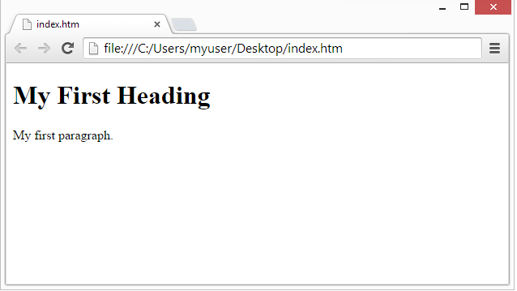
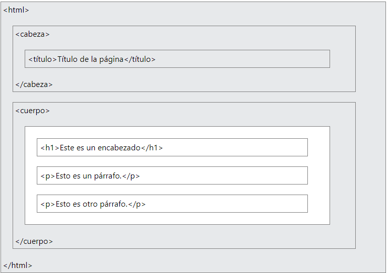

# BootCamp De HTML5 - Session 0

## 0.2 Introduución HTML

HTML es el lenguaje estándar de marcado para crear páginas web.

## ¿Qué es HTML?

* HTML significa Lenguaje de Marcado de Hipertexto

* HTML es el lenguaje de marcado estándar para crear páginas web

* HTML describe la estructura de una página web

* HTML consiste en una serie de elementos

* Los elementos HTML indican al navegador cómo mostrar el contenido

* Los elementos HTML etiquetan partes de contenido como "esto es un encabezado", "esto es un párrafo", "esto es un enlace", etc.

## Un documento HTML sencillo

### Ejemplo

```html
<!DOCTYPE html>
<html>
<head>
<title>Graphic Data Studio</title>
</head>
<body>


<h1>My First Heading</h1>
<p>My First Paragrph.</p>


<body>
</html>
```

## Ejemplo explicado

* La declaración define que este documento es un documento HTML5<!DOCTYPE html>

* El elemento es el elemento raíz de un HTML Paging `<html>`

* El elemento contiene metainformación sobre el Página HTML `<head>`

* El elemento especifica un título para el Página HTML (que se muestra en la barra de título del navegador o en la pestaña de la página) `<title>`

* El elemento define el y es un contenedor para todos los contenidos visibles, como encabezados, párrafos, imágenes, hipervínculos, tablas, listas, etc. `<body>`

* El elemento define un encabezado grande `<h1>`

* El elemento define un párrafo `<p>`

## ¿Qué es un elemento HTML?

* Un elemento HTML se define mediante una etiqueta de inicio, algo de contenido y una etiqueta de final:

`<nombre de etiqueta> El contenido va aquí... </nombre de etiqueta>`

* El elemento HTML es todo, desde la etiqueta inicial hasta la etiqueta final:

`<h1>Mi Primer rumbo</h1>`

`<p>Mi primer párrafo. </p>`

| Start tag | Element content     | End tag |
| --------- | ------------------- | ------- |
| `<h1>`    | My First Heading    | `</h1>` |
| `<p>`     | My first paragraph. | `</p>`  |
| `<br>`    | none                | none    |

**Nota:** Algunos elementos HTML no tienen contenido (como el `<br>` elemento). Estos elementos se llaman elementos vacíos. ¡Los elementos vacíos no tienen etiqueta final!

## Navegadores web

* El propósito de un navegador web (`Chrome, Edge, Firefox, Safari`) es leer documentos `HTML` y mostrarlos correctamente.

* Un navegador no muestra las etiquetas `HTML`, sino que las utiliza para determinar cómo mostrar el documento:



## Estructura de la página HTML

* A continuación se muestra una visualización de la estructura de una página HTML:



## Historia de HTML

Desde los primeros días de la World Wide Web, ha existido muchas versiones de HTML:

| Year | Version                                 |
| ---- | --------------------------------------- |
| 1989 | Tim Berners-Lee invented www            |
| 1991 | Tim Berners-Lee invented HTML           |
| 1993 | Dave Raggett drafted HTML+              |
| 1995 | HTML Working Group defined HTML 2.0     |
| 1997 | W3C Recommendation: HTML 3.2            |
| 1999 | W3C Recommendation: HTML 4.01           |
| 2000 | W3C Recommendation: XHTML 1.0           |
| 2008 | WHATWG HTML5 First Public Draft         |
| 2012 | WHATWG HTML5 Living Standard            |
| 2014 | W3C Recommendation: HTML5               |
| 2016 | W3C Candidate Recommendation: HTML 5.1  |
| 2017 | W3C Recommendation: HTML5.1 2nd Edition |
| 2017 | W3C Recommendation: HTML5.2             |

Este curso sigue el último estándar `HTML5`.
